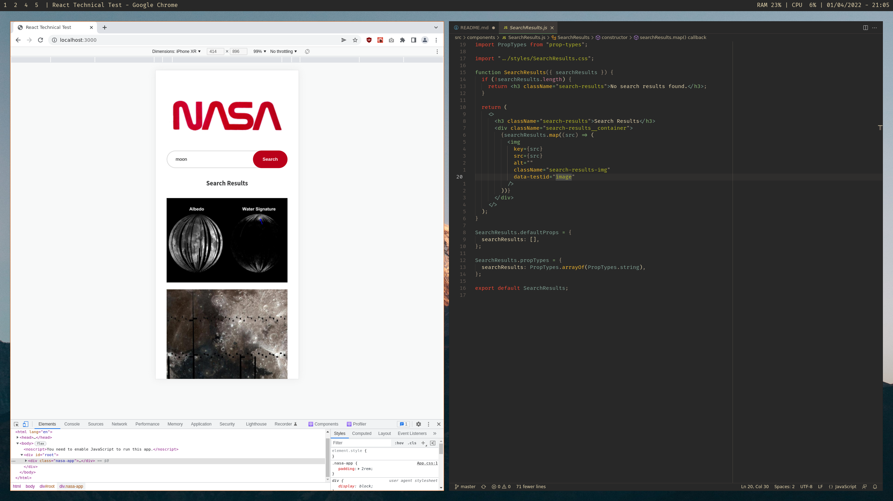
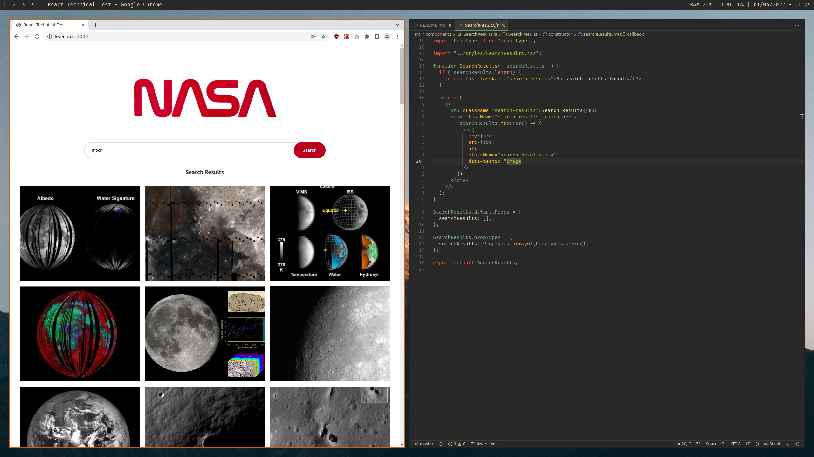

# MCR Codes NASA Tech Test

This project was created to get a feel for what a tech test might look like in the industry.

## Task

Build and design a search page which allows users to search for images by keyword using the NASA image API.

**Brief:**
* Build a search page which allows users to search for images by keyword.
* Images must be returned upon a successful search.
* The styling is up to you but will be taken into consideration when evaluating your application.

## Screenshots

## Built With

This application was built using the [React](https://reactjs.org/) library using a functional component approach.

## Testing Libraries

I took a BDD approach when it came to testing the application, first building the component and implementing the required features, and then testing against the acceptance criteria.

**Testing libraries include:**

* [Jest](https://jestjs.io/)
* [React Testing Library](https://testing-library.com/)

## Packages Used

In addition to the testing libraries mentioned above:

* ESLint - used to follow industry standard rules with some slight configurations.
* Prettier - used to ensure consistency in code formatting.
* Prop Types - used to type check this React application and catch errors before runtime.
* Axios - used to make requests to the NASA API endpoint.

## Installation Instructions

* Clone this repo
  * e.g. `git@github.com:invertostew/nasa-tech-test.git`
* Change directory into the repo
  * e.g. `cd nasa-tech-test` (or the directory you specified the repo to be cloned into)
* Install the dependencies from `package-lock.json`
  * `npm install`
* To start the app:
  * `npm start`
* To test the app:
  * `npm test`

## If I Had More Time

I would like to implement:

* Organise the image search results in a masonry layout, allowing me to remove the `max-height` property on the images, and allowing for a better flow. I would do this by splitting the results into separate columns allowing for better control.
* Write tests for the `getImages` request function.
* Add some UI helpers such as providing the user with some tags that they can click to search common terms.

## Author

This project was authored by Stuart Green.
